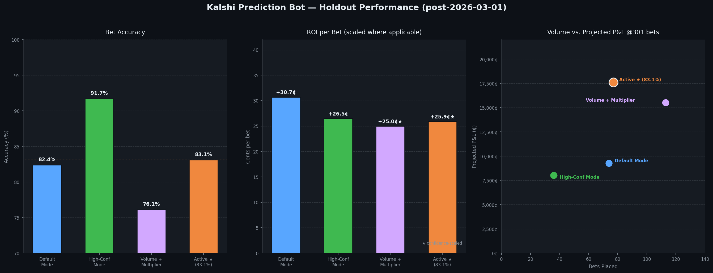
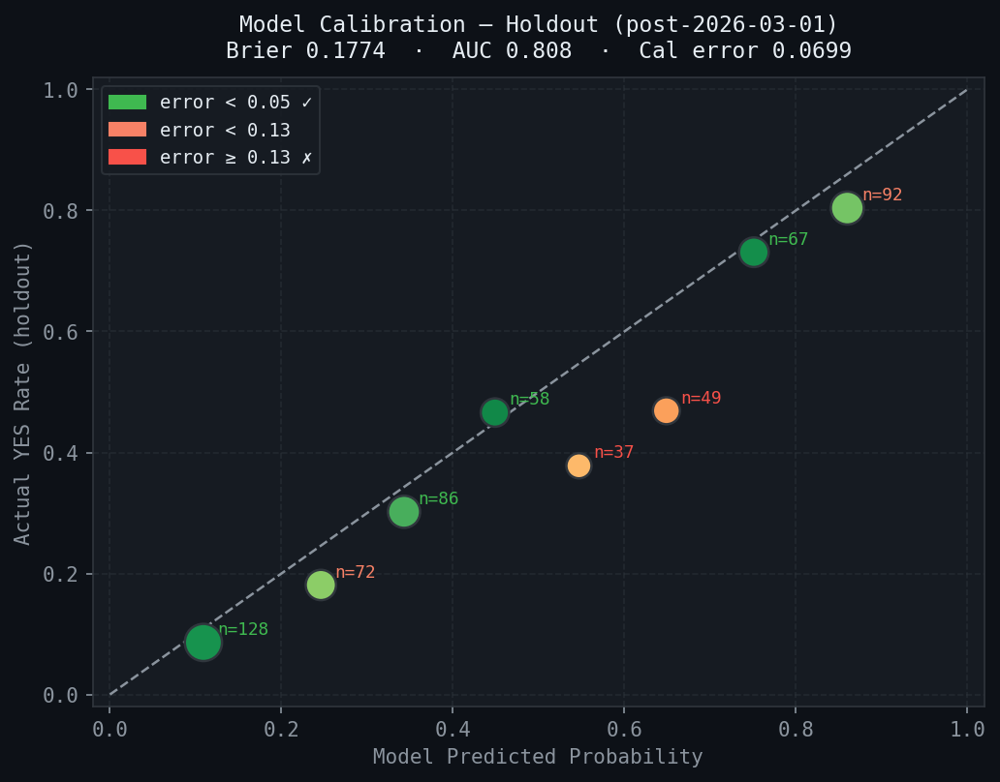

# Kalshi Prediction Market Trading Bot

> Built at **[Qourex](https://github.com/jacobsfat)** — a quantitative trading startup building ML-driven systems for political prediction markets.

An end-to-end machine learning pipeline that predicts whether political figures will say specific words during live speeches, then executes real-time bets on [Kalshi](https://kalshi.com) prediction markets using fractional Kelly criterion sizing.

**Current holdout accuracy: 83.1% · AUC-ROC: 0.808 · Projected P&L: +$175.96 @ 301 bets**

---

## How It Works

```
Speech transcript
      ↓
Word counter (speaker-turn filtered)
      ↓
23-feature LightGBM ensemble
  ├── Speaker hit-rate profiles
  ├── News relevancy (Google News RSS)
  └── Sentence-transformer topic similarity
      ↓
Kelly criterion position sizing
  ├── Bid-ask spread gate  (≤ 10¢)
  ├── Volume gate          (≥ $100)
  └── Time-to-close gate   (≥ 30s)
      ↓
Trade logged to SQLite
```

---

## Performance (Holdout — post 2026-03-01)

| Metric | Active Mode |
|---|---|
| Bets placed | 77 |
| **Bet accuracy** | **83.1%** |
| ROI / bet | +25.9¢ scaled |
| Total P&L | +$45.01 |
| Projected P&L @ 301 bets | **+$175.96** |
| AUC-ROC | 0.808 |
| Brier score | 0.1774 |

> Active mode gates YES bets at model probability ≥ 0.72 and NO bets at ≤ 0.30, combined with a 1–3x confidence multiplier on Kelly sizing. This cuts the over-predicted 0.5–0.7 probability range and maximizes risk-adjusted returns.

### Mode Comparison


### Calibration


---

## Model — 23 Features

| Category | Features |
|---|---|
| Speaker history | `hit_rate_lifetime`, `hit_rate_recent`, `momentum`, `recency`, `n_samples_lifetime`, `n_samples_recent` |
| Word priors | `hit_rate_word_global`, `hit_rate_word_in_event_type`, `hit_rate_speaker_event_type`, `word_rank` |
| Market signals | `kalshi_odds`, `market_vs_history`, `market_vs_word_prior`, `event_type_prior`, `hit_rate_credibility` |
| News signals | `rel_max`, `rel_mean`, `rel_top3_mean`, `rel_count_hi`, `rel_n` |
| Event context | `topic_match`, `days_since_last_event`, `events_in_last_30d` |

**Ensemble:** 11-seed LightGBM average + logistic regression blend, isotonic regression calibration.

---

## Stack

| Layer | Tech |
|---|---|
| Language | Python 3.12+ |
| ML | LightGBM, scikit-learn |
| NLP | sentence-transformers (`all-MiniLM-L6-v2`) |
| Data | pandas, NumPy, SQLite |
| APIs | Kalshi Trade API v2, Google News RSS, YouTube Data API |
| Infra | Custom SQLite layer (`db.py`), daemon shell script for harvest scheduling |

---

## Project Structure

```
kalshi/
├── run_pipeline.py            # Main entry point — event mode or speaker mode
├── kalshi_model.py            # LightGBM ensemble, training, CV, inference
├── kalshi_api.py              # Kalshi REST API client + KalshiMarket dataclass
├── db.py                      # SQLite schema and query layer
├── profile_agent.py           # Speaker hit-rate profile builder
├── news_scraper.py            # Google News aggregation + relevancy scoring
├── topic_match.py             # Sentence-transformer event/word similarity
├── transcript_bot.py          # Speech transcript scraper (White House, C-SPAN)
├── kalshi_word_counter.py     # Target word counter with speaker-turn filtering
├── backtest.py                # Historical backtesting pipeline
├── pseudo_trade.py            # Fixed-holdout evaluator (Brier, AUC, P&L, ROI)
└── harvest_training_data.py   # Scrapes settled markets into training_data table
```

---

## Quick Start

```bash
git clone https://github.com/jacobsfat/worm-files.git kalshi-bot
cd kalshi-bot
pip install -r requirements.txt
cp .env.example .env   # add KALSHI_API_KEY, YOUTUBE_API_KEY

# Run against a specific Kalshi event
python run_pipeline.py --event KXTRUMPSOTU-26FEB25

# Auto-discover all events for a speaker
python run_pipeline.py --speaker "Donald Trump"

# Evaluate model on holdout set
python pseudo_trade.py
```

---

## Tracked Speakers

Donald Trump · J.D. Vance · Jerome Powell · Marco Rubio · Pete Hegseth · Michael Barr
